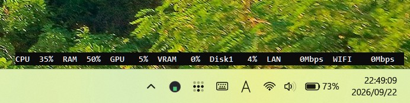
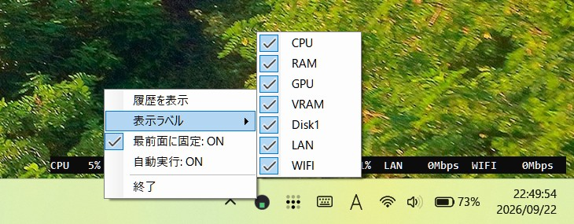

# TaskbarStats

[日本語](README.md) | [English](README.en.md)

Version 1.3.0

TaskbarStats is a lightweight Windows system monitor that continuously displays CPU, memory, GPU, disk, and network status at the right side of the taskbar.

The display updates every second. Use the tray icon context menu to select displayed metrics, toggle always-on-top behavior, and configure startup launch. No installer is required: run the downloaded EXE or extract the ZIP package.

## Screenshots

Normal display:



Context menu and metric selection:



## Download

Download the latest version from the [Releases page](https://github.com/masacgt/taskbar-stats/releases).

| File | Use |
|---|---|
| [ZIP package](https://github.com/masacgt/taskbar-stats/releases/download/v1.3.0/taskbar-stats-v1.3.0-win-x64.zip) | Standard package containing the EXE and required files. Extract it before use. |
| [Standalone EXE](https://github.com/masacgt/taskbar-stats/releases/download/v1.3.0/TaskbarStats-v1.3.0-win-x64.exe) | Starts from a single file and is convenient to carry. |
| [Latest release](https://github.com/masacgt/taskbar-stats/releases/latest) | Opens the latest available release. |

The ZIP package and standalone EXE are self-contained. .NET 8 Runtime does not need to be installed separately.

### First launch

1. Extract the ZIP package to any folder, if you downloaded the ZIP version.
2. Start `TaskbarStats.exe`.
3. The statistics appear at the right side of the taskbar.
4. To exit, right-click the display or tray icon and select **Exit**.

If Windows SmartScreen appears, confirm the publisher and file name before running the app.

## Displayed metrics

- **CPU**: CPU utilization
- **RAM**: Memory utilization
- **GPU**: GPU utilization
- **VRAM**: GPU memory utilization
- **Disk1, Disk2, ...**: Active time for each physical disk
- **LAN**: Wired LAN transfer speed in Mbps
- **WIFI**: Wi-Fi transfer speed in Mbps

Right-click the tray icon and open **Display labels** to show or hide each metric. Hiding unused metrics keeps the taskbar display compact.

## Controls

Right-click the tray icon or taskbar display to access these actions.

| Action | Description |
|---|---|
| Show history | Opens CPU, RAM, GPU, and VRAM graphs for approximately the last five minutes. Double-clicking also opens the graph. |
| Display labels | Shows or hides CPU, RAM, GPU, VRAM, Disk, LAN, and WIFI. |
| Always on top | Keeps the taskbar display above other windows. |
| Startup | Toggles launch at Windows sign-in. |
| Exit | Exits the application. |

The tray icon turns yellow at 70% load and red at 90% load.

## Display language

The user interface is selected automatically from the Windows display language. There is no language menu or per-user language setting.

- Japanese Windows display language (`ja-*`): Japanese
- All other display languages: English

Metric labels such as CPU, RAM, GPU, LAN, and WIFI are shared across both languages.

## GPU support

| GPU | Utilization | VRAM | Temperature | Clock |
|---|---:|---:|---:|---:|
| NVIDIA | Yes | Yes | Yes | Yes |
| AMD | Yes | Yes | Yes | Yes |
| Other | Yes | Yes | No | No |

TaskbarStats uses NVAPI for NVIDIA and ADL2 for AMD when available. If the vendor API cannot be loaded, it falls back to Windows Performance Data Helper (PDH) and DXGI for GPU utilization and VRAM.

CPU, RAM, disk, LAN, and WIFI monitoring continue to work when no supported GPU is detected. GPU and VRAM are shown as `-` or `--`.

## Requirements

- Windows 10 or Windows 11
- x64 PC
- ZIP and standalone EXE packages do not require .NET 8 Runtime
- GPU features depend on the installed GPU and driver

## Troubleshooting

1. Check Task Manager to make sure `TaskbarStats.exe` is not already running. The app prevents multiple instances.
2. If using the ZIP package, extract all files before starting the EXE.
3. Check whether Windows Defender or another security product quarantined the file.
4. If the display does not update, check `%LOCALAPPDATA%\\TaskbarStats\\crash.log`.
5. If the issue persists, open an Issue with the file name, Windows version, and relevant `crash.log` contents.

## Build for developers

The .NET 8 SDK is required.

```bash
dotnet restore
dotnet build TaskbarStats.sln -c Release
dotnet test TaskbarStats.sln -c Release
```

Create a self-contained Windows x64 build:

```bash
dotnet publish TaskbarStats/TaskbarStats.csproj \
  -c Release \
  -r win-x64 \
  --self-contained true \
  -p:PublishSingleFile=true \
  -p:IncludeNativeLibrariesForSelfExtract=true \
  -o dist
```

Create a framework-dependent build:

```bash
dotnet publish TaskbarStats/TaskbarStats.csproj \
  -c Release \
  -r win-x64 \
  --self-contained false \
  -o dist-framework
```

## Project structure

```text
TaskbarStats/
  Program.cs                    Entry point and single-instance management
  Samplers/                     CPU, RAM, GPU, disk, LAN, and WIFI samplers
  UI/                           Tray menu, taskbar display, and history window
  Utils/                        Startup registration and Windows integration
TaskbarStats.Core/              OS-independent calculations and history
TaskbarStats.Tests/             Unit tests for the Core project
```

## License

MIT License


